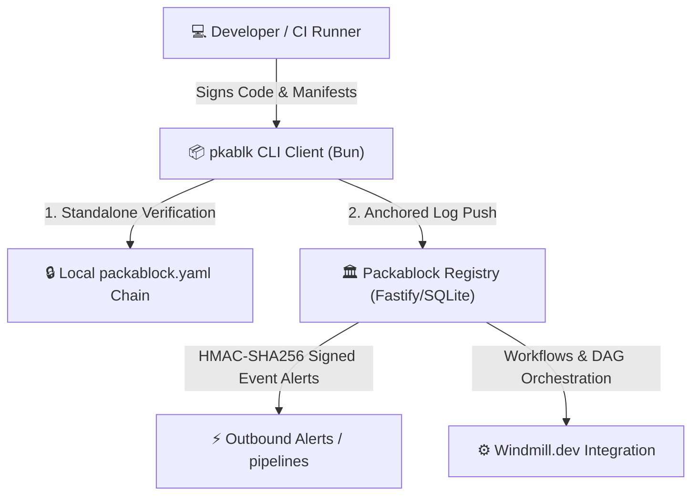

# 🛡️ Packablock: Zero-Trust Supply Chain Trust Registry

<div align="center">

[](https://github.com/Packablock/packablock-client/actions/workflows/ci.yml)
[](https://github.com/Packablock/packablock-registry/actions/workflows/ci.yml)
[](https://github.com/Packablock/packablock-web/actions/workflows/ci.yml)

</div>

Packablock orchestrates **decentralized, zero-trust package attestation and supply chain trust ledgers** to protect developer workflows from split-timeline attacks, dependency regressions, and malicious software injections.

By combining native cryptographic signing (SSH/GPG), automated CI/CD gating, and real-time SemVer intelligence pipelines, Packablock guarantees absolute transparency and verification for all software artifacts.

---

## 🔮 Core Architectural Ecosystem

The Packablock ecosystem is partitioned into modular, highly cohesive components:



### 1. [pkablk CLI Client](https://github.com/Packablock/packablock-client)
A lightweight Bun-based developer command-line interface and binary executable that coordinates SBOM baselines, cryptographic appends, and local ledger checks:
* **`pkablk init`**: Baselines package lockfiles to build the Genesis block.
* **`pkablk check`**: Offline constant-memory verification (Standalone Mode) or online anchored verification against the registry (`--server`).
* **`pkablk pack`**: Bundles verified dependencies and signed release assets into safe tarballs.
* **`pkablk rollover`**: Rotates client keys and securely chains old metadata hashes across rollover boundaries.

### 2. [Packablock Supply Chain Trust Registry](https://github.com/Packablock/packablock-registry)
A secure, high-performance Fastify server backed by SQLite that acts as the sovereign cryptographic log anchor for active workspaces:
* **Continuous Ingestion**: Secure REST endpoints (`/api/v1/log/push`) that process client signatures, Git OIDC runner claims, and log anchoring receipts.
* **Interactive Trust Tree UI**: Built-in administrative dashboard serving undulating horizontal D3.js node-link trust ledgers, proportional epoch graphs, and deep-linkable hash routing.

### 3. [Windmill Workflows Template](https://github.com/Packablock/packablock-demo/tree/main/windmill)
A template for [windmill.dev](https://windmill.dev) worker orchestration enabling traceable, idempotent, and self-hosted validation DAGs for auditing workspaces in high-scale enterprise registries.

### 4. [Packablock Web Dashboard](https://github.com/Packablock/packablock-web)
A zero-trust administrative Web Dashboard, implemented as a Ruby on Rails 8 application querying Fastify registry endpoints and rendering premium controls, telemetry metrics, and authorization actions.

---

## 🛠️ Workspace Developer Tooling

The root workspace includes unified utilities to orchestrate local development, test gates, and remote status:

| Script | Purpose | Usage |
| :--- | :--- | :--- |
| `scripts/check-builds.sh` | Runs typechecking, Biome linters, and full test suites locally across all Node/Bun, Rails, and Jekyll repos. | `./scripts/check-builds.sh` |
| `scripts/check-github-activity.py` | Queries the GitHub API to display open issues, active PRs, latest CI runs, and releases for all repos. | `./scripts/check-github-activity.py` |
| `scripts/daily-standup.sh` | Consolidates emails, checks local git diffs, outputs current WIP, and pushes standup logs to the private workspace. | `./scripts/daily-standup.sh` |

---

## 📊 SemVer Candle Graph Analysis

The `pkablk` client introduces visual risk modeling for supply chain verification by charting installation drift, constraint boundaries, and upstream registry availability directly in monospace printouts:

```markdown
-----------------------------------------------------------------------------------------
Package Name      Constraint  Version Timeline (Low -> Installed -> Upstream -> Max)
-----------------------------------------------------------------------------------------
fastify           ^4.21.0     4.21.0 |░░░░░░░░●══════════════════════════| 4.99.9
                              [Min]   [First] [Pinned: 4.24.2]   [Latest: 4.28.0] [Ceiling]

bun-types         ~2026.2.0   2026.2.0 |░░●═════| 2026.2.15
                              [Min]     [Pinned: 2026.2.4]                 [Ceiling]

jq-web             >=1.0.0     1.0.0  |░░░░░░░░░░░░░░░░●══════════════════════════════════► ∞
                              [Min]   [First: 1.0]     [Pinned: 2.0.0]  [Latest: 2.4.5]
-----------------------------------------------------------------------------------------
```
* **The Candle Body (`░░░░●`)**: Visually indicates historical drift between package introduction and current installations.
* **The Right Wick Ceiling (`═══|`)**: Showcases remaining safe minor/patch versions before hitting a breaking constraint.
* **The Open Fuse (`► ∞`)**: Alerts developers instantly to unbounded version descriptors (`>=`) vulnerable to split-timeline regressions.

---

## ⚡ Deployment & Sovereign Options

Packablock supports three isolated operational models:
1. **Centrally Hosted SaaS**: Secure, ready-to-use cloud-anchored ledgers for development teams.
2. **Enterprise BYOR (Bring Your Own Registry)**: Private, sovereign registries deployed in Docker / Cloud Run using standard Terraform modules.
3. **Decentralized Standalone**: Mesh comparisons between peer logs (`pkablk check --peer <url>`) for off-grid operations.

---

<div align="center">
  <sub>© 2026 Packablock Inc. Protecting the software ecosystem with cryptographic zero-trust rails.</sub>
</div>
